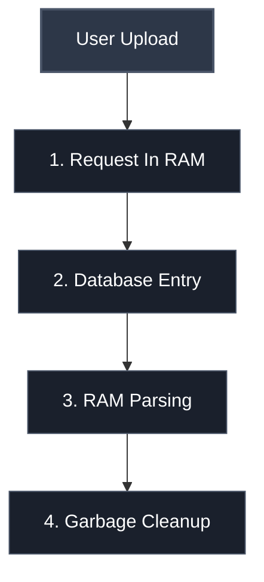

# FactFlow 

The production App for the PDF Fact-Check Analysis platform. Built with Django, Python 3.13, and PostgreSQL, optimized with a stateless architectural design.

## Key Architecture Features
* **Stateless PDF Processing**: Zero physical storage writes for uploaded documents to guarantee enterprise-level data privacy.
* **Concurrent Fact-Checking**: Leverages multi-threading with optimized minimal thread pools to process extracted claims in parallel.
* **Automated Live Search**: Integrates with concurrent search endpoints to cross-reference statements across web indices dynamically.

---

## The Lifecycle of Your PDF File

The backend pipeline processes files fluidly using a strict **RAM-only lifecycle**:

